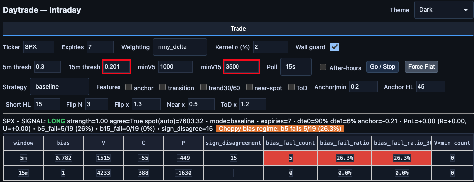
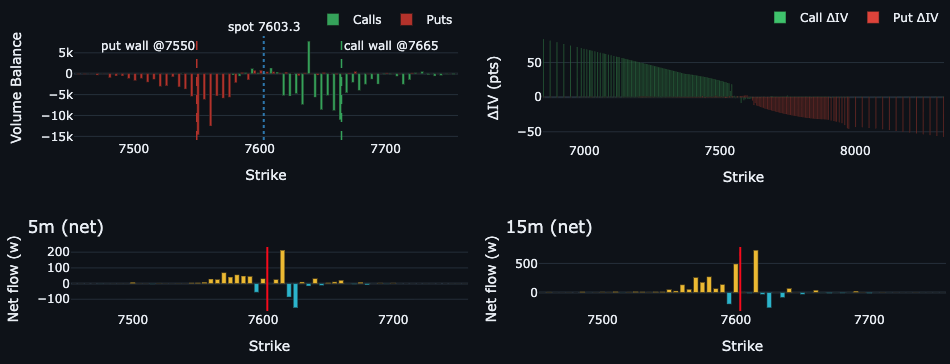

# daytrade

An intraday **options order-flow** signal engine for index and large-cap underlyings
(SPX, QQQ, and others). It reads **net aggressor volume** (`volmbs` = buy-initiated
minus sell-initiated contracts) from the [Convex Value](https://convexvalue.com)
options API across several rolling time windows, condenses it into a directional
bias per timeframe, and emits **long / short / flat** signals when a fast (5-minute)
flow impulse is confirmed by a slower (15-minute) window — then applies a
persistence + hold layer so signals turn into stable positions instead of noise.

It ships with a command-line runner, a [Dash](https://dash.plotly.com/) web UI,
an SPX option-wall detector, a 0DTE dealer/customer ledger, and a calibrator that
tunes per-ticker thresholds from your own logged history.

> **Bring your own Convex Value account.** To fetch live data and generate signals,
> you must provide your own Convex Value login email and password through
> `CONVEX_EMAIL` and `CONVEX_PASSWORD`. Credentials and market-data access are not
> included with this project. You also need the `convexlib` client; see
> [Requirements](#requirements) and [Configuration](#configuration).

> ⚠️ **Disclaimer.** This project is for research and educational purposes only.
> It is **not** financial advice and makes **no** guarantee of profitability.
> Options trading involves substantial risk of loss. You are solely responsible
> for any use of this software and for any trades you place. See `LICENSE`.

---

## Table of contents

- [Screenshots](#screenshots)
- [How it works](#how-it-works)
- [SPX vs QQQ behavior](#spx-vs-qqq-behavior)
- [Repository layout](#repository-layout)
- [Requirements](#requirements)
- [Installation](#installation)
- [Configuration](#configuration)
- [Usage](#usage)
- [Calibrating thresholds](#calibrating-thresholds)
- [Strengths & limitations](#strengths--limitations)

---

## Screenshots

**Signal dashboard.** Configure the ticker, polling interval, flow thresholds,
strategy, and wall guard. The status line and table show the current directional
signal, flow bias, activity, and diagnostic alerts.



**Flow charts.** Inspect call and put volume balance with detected wall levels,
call/put IV changes by strike, and weighted net flow over 5-minute and 15-minute
windows.



These screenshots show an example session; the displayed values and settings
are not live data or necessarily the project defaults. The dashboard's P&L tracks
theoretical underlying-price movement in points, not brokerage returns or
options-contract profits. Signals do not automatically place brokerage orders.

## How it works

Every poll the engine fetches the option chain (nearest ~7 expirations) and runs
this pipeline:

1. **Read flow.** For each strike and leg (call/put) it pulls `volmbs_5m`,
   `volmbs_15m`, `volmbs_30m`, `volmbs_60m`, and `volm_bs` (since the open).
   `volmbs` is *net aggressor volume*: contracts that lifted the ask (buys) minus
   contracts that hit the bid (sells). Positive = aggressive buying.

2. **Weight strikes.** Each strike is weighted by a moneyness Gaussian
   `exp(-(dist / mny_band)^2)` (near-spot strikes dominate) and, in the default
   `mny_delta` mode, multiplied by `|delta|` to further emphasize at-the-money
   activity. SPX additionally applies a time-of-day **expiry weight** (0DTE is
   up-weighted into the close).

3. **Collapse to a bias.** For each window it computes weighted call flow `C`,
   weighted put flow `P`, total activity `V = Σ|weighted|`, and

   ```
   bias = (C − P) / (|C| + |P|)      # range −1 … +1
   ```

   A positive bias means call buying / put selling dominates (bullish); negative
   is the reverse.

4. **Two-timeframe signal.** A raw signal fires only when the fast window is
   strong *and* the slow window confirms it in the same direction:

   ```
   ok5  = (V5  ≥ minV5)  and (|bias5|  ≥ thresh5)
   ok15 = (V15 ≥ minV15) and (|bias15| ≥ thresh15) and sign(bias15) == sign(bias5)
   signal = long  if ok5 and ok15 and bias5 > 0
            short if ok5 and ok15 and bias5 < 0
            flat  otherwise
   ```

5. **Persistence + hold (hysteresis).** The UI turns raw signals into positions:
   a signal must repeat for `persistence` consecutive polls before entering;
   once in a position, **relaxed** hold thresholds (~75% of entry) keep you in,
   and the position exits on sustained bias decay, sign disagreement, or a failed
   hold window. This is what prevents single-print whipsaws.

6. **SPX wall guard (SPX only).** A detector tracks per-strike flow over time to
   find **put walls** (support) and **call walls** (resistance) near spot. The
   guard *vetoes* signals that point straight into a fresh, healthy wall (kills
   longs into a call wall, shorts into a put wall).

A zero-gamma / IV-context engine also runs for display, but **it does not affect
trade decisions.**

## SPX vs QQQ behavior

The same core runs for every ticker, but SPX gets extra microstructure-aware
handling. Per-ticker parameters live in [`thresholds.json`](./thresholds.json).

| Feature | SPX | QQQ |
|---|---|---|
| `thresh5` / `thresh15` (bias gates) | 0.30 / 0.20 | 0.40 / 0.25 |
| `minV5` / `minV15` (activity floors) | 1000 / 3500 | 4000 / 6000 |
| Time-of-day expiry weighting (0DTE emphasis) | ✅ Yes | ❌ No (expiries summed flat) |
| Option wall detector + veto guard | ✅ Yes | ❌ No |
| Spot source | Convex `get_und` | Convex `get_und` |

SPX uses lower bias thresholds because its flow is more two-sided; QQQ uses higher
thresholds and volume floors. Because the expiry weighting and wall guard are
SPX-only, **the QQQ signal is intentionally cruder** — treat it as a secondary
ticker. Adding a ticker is as simple as adding a block to `thresholds.json`.

## Repository layout

```
daytrade/
├── dt.py               # Core engine: flow math, signal generation, CLI entrypoint
├── ui.py               # Dash web UI (port 8052) + entry/hold/persistence gating
├── calibrate.py        # Derive per-ticker thresholds from logged JSONL history
├── store.py            # SQLite storage for intraday context (ctx.db)
├── thresholds.json     # Per-ticker bias/volume/persistence parameters
├── fetch_tas.py        # Convex time-and-sales fetch example
├── und_probe.py        # Convex underlying (get_und) probe utility
├── brokers/
│   └── tradier.py           # Minimal Tradier REST client (equity orders)
├── walls/
│   ├── detector.py     # Rolling per-strike wall detection (support/resistance)
│   └── guard.py        # Signal veto when pointing into a wall
├── scripts/
│   └── spx_ledger.py   # SPX 0DTE dealer/customer exposure ledger (open/close)
└── assets/
    └── theme.css       # UI styling
```

> **Note on data files.** Market databases (`ctx.db`, `pg_database*.db`), `logs/`,
> and `.venv/` are intentionally **not** included in the repository (see
> `.gitignore`). They are generated/derived locally.

## Requirements

- **Python 3.13** (developed on 3.13.7)
- Your own **Convex Value** account with access to the options-flow API, plus
  your login email and password. Every user must supply their own credentials.
- The **`convexlib` client**, which is **not** on public PyPI — install it from
  your Convex account / private index. Installing `requirements.txt` alone does
  not install this client.
- *(Optional)* a **Tradier** account if you wire up order placement.

Python dependencies are pinned in [`requirements.txt`](./requirements.txt):
`dash`, `numpy`, `pandas`, `plotly`, `requests`.

## Installation

Clone into a folder named `daytrade` (the package uses absolute
`from daytrade...` imports, so it is run as a module from its **parent**
directory):

```bash
git clone https://github.com/<your-account>/daytrade.git
cd daytrade

python3.13 -m venv .venv
source .venv/bin/activate          # Windows: .venv\Scripts\activate
pip install -r requirements.txt
# then install convexlib from your Convex Value account/private index
```

## Configuration

From inside the `daytrade` folder, copy the example environment file:

```bash
cp .env.example .env
```

Edit `.env` and replace the placeholders with **your own Convex Value login**:

```bash
CONVEX_EMAIL='your-convex-login@example.com'
CONVEX_PASSWORD='your-convex-password'
CONVEX_ENV='live'  # Use live or pro as appropriate for your account.
```

These are example values, not working credentials. Keep your real `.env` local;
it is excluded by `.gitignore`. Do not upload it to GitHub.

The app reads environment variables; it **does not automatically load `.env`**.
With your virtualenv active, load the file into your shell, move to the parent
folder, and launch the dashboard (macOS/Linux, Bash or Zsh):

```bash
set -a
source .env
set +a
cd ..
python -m daytrade.ui
```

Open <http://127.0.0.1:8052>. Repeat the environment-loading step in each new
shell session. Without valid Convex credentials and API access, the dashboard
cannot fetch live data or generate live signals.

| Variable | Required | Purpose |
|---|---|---|
| `CONVEX_EMAIL`, `CONVEX_PASSWORD` | ✅ | Convex Value login (options data) |
| `CONVEX_ENV` | ✅ | `live` or `pro` |
| `SPX_LEDGER_DB` | optional | Override path to the SPX ledger DB |
| `DAYTRADE_UI_THEME` | optional | `dark` or `light` |

Per-ticker signal parameters (`thresh5`, `thresh15`, `minV5`, `minV15`,
`persistence`, and SPX-only `mny_band` / `view_band_pct`) live in
[`thresholds.json`](./thresholds.json).

## Usage

Run everything as a module from the directory **containing** the `daytrade`
folder, with your virtualenv active and `.env` loaded (e.g. via
`set -a; source daytrade/.env; set +a`).

**Command-line signals (run once):**

```bash
python -m daytrade.dt --tickers SPX QQQ --weighting mny_delta --mny_band 0.02
```

**Poll continuously and log diagnostics** (logs feed the calibrator):

```bash
python -m daytrade.dt --tickers SPX --poll 30 --log
```

**Launch the web UI** (http://127.0.0.1:8052):

```bash
python -m daytrade.dt --ui
# or directly:
python -m daytrade.ui
```

**SPX 0DTE ledger** (run around the open and the close):

```bash
python -m daytrade.scripts.spx_ledger --mode open
python -m daytrade.scripts.spx_ledger --mode close
```

**Quick API probes:**

```bash
python -m daytrade.und_probe SPX
python -m daytrade.fetch_tas --symbol TSLA
```

Useful `dt.py` flags: `--thresh5 --thresh15 --minV5 --minV15` (override gates),
`--exp_count` (expirations to fetch), `--spot` / `--no_spot_auto`,
`--after_hours`, `--thresholds <path>`.

## Calibrating thresholds

Thresholds are not magic numbers — they are derived from your own logged polls.
After collecting a few days of `--log` output:

```bash
python -m daytrade.calibrate \
  --logs logs/daytrade-20260106 logs/daytrade-20260107 \
  --out daytrade/thresholds.json
```

For each ticker it uses the ~60th percentile of historical `|bias|` (volume-weighted,
clamped to a sane range) for the bias gates and the ~70th percentile of activity
for the volume floors, ignoring thin prints that would saturate the bias at ±1.

## Strengths & limitations

**Strengths**

- Net-aggressor flow, weighted to at-the-money, with a fast-trigger / slow-confirm
  gate is a legitimate microstructure read for index 0DTE.
- Strong anti-whipsaw design: persistence-to-enter, relaxed-to-hold, and multiple
  independent exits.
- Thresholds are empirically calibrated per ticker, not hand-guessed.
- SPX path encodes real dealer-hedging intuition (0DTE-into-close weighting, wall veto).

**Limitations**

- `volmbs` can't distinguish opening from closing trades — buying a call and
  selling a put are treated as equally bullish, which blurs intent.
- QQQ (and any non-SPX ticker) lacks expiry weighting and the wall guard, so its
  signal is weaker than SPX's.
- Many stacked, tuned constants — powerful but overfit-prone; only SPX/QQQ are
  genuinely tuned.
- Signals are pure flow: there is no price/PnL confirmation and no built-in
  stop-loss in the signal logic itself.
- Runtime state (walls, fail-windows, position mode) lives in memory and resets
  on restart.

## License

Licensed under the Apache License 2.0 — see [`LICENSE`](./LICENSE) and
[`NOTICE`](./NOTICE).
